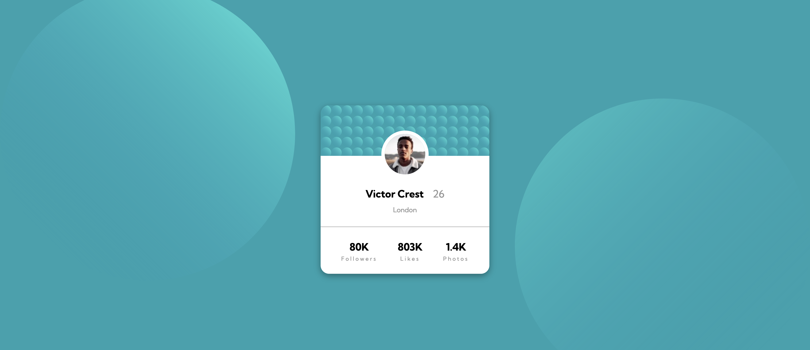

# Frontend Mentor - Profile card component solution

This is a solution to the [Profile card component challenge on Frontend Mentor](https://www.frontendmentor.io/challenges/profile-card-component-cfArpWshJ). Frontend Mentor challenges help you improve your coding skills by building realistic projects. 

## Table of contents
  - [The challenge](#the-challenge)
  - [Screenshot](#screenshot)

- [My process](#my-process)
  - [Built with](#built-with)
  - [What I learned](#what-i-learned)
- [Author](#author)
- [Acknowledgments](#acknowledgments)

### The challenge

- Build out the project to the designs provided

### Screenshot

### Links

- Solution URL: [Add solution URL here](https://your-solution-url.com)

## My process
My process behind this was trying to make it as simple as it looks without overdoing the CSS and HTML
### Built with

- Semantic HTML5 markup
- CSS custom properties
- Flexbox

### What I learned

This was a great way to practice basic HTML and CSS skills.

### Continued development

I'm curious to know how other developers approach flexbox in flexbox situations and if there are simpler ways

## Acknowledgments

Thanks to the Kevin Powell and Colt Steele Discord channels for coming through with feedback and help for all the web dev questions 

